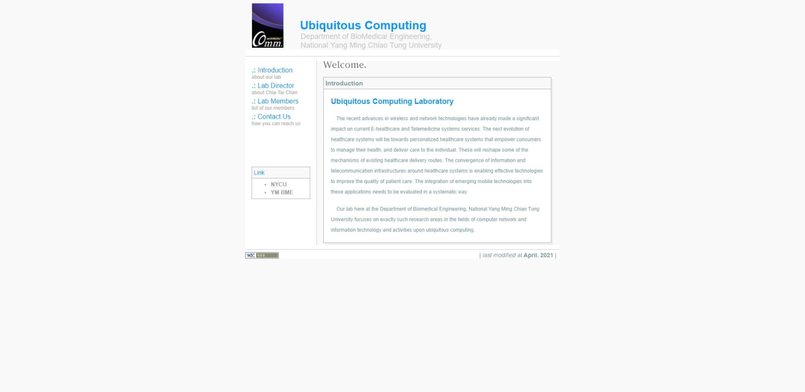
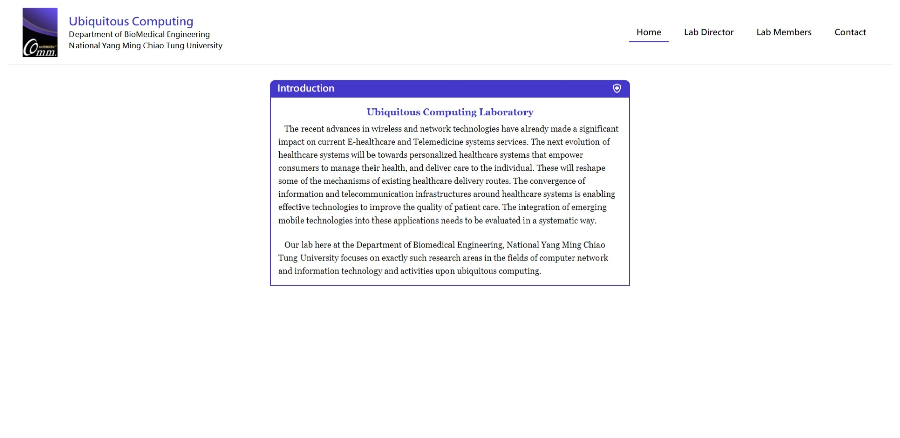
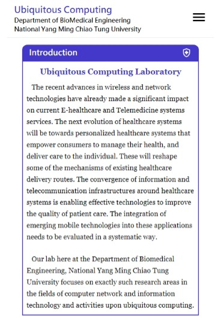
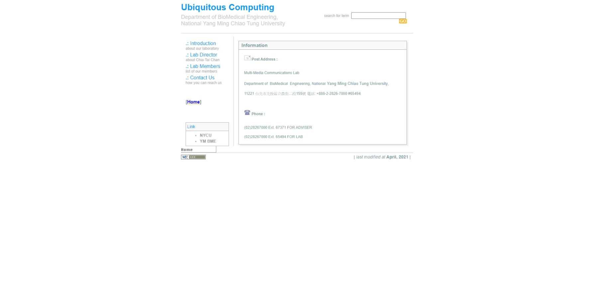
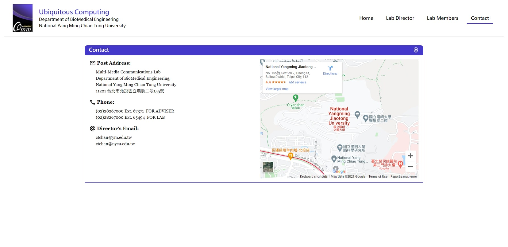
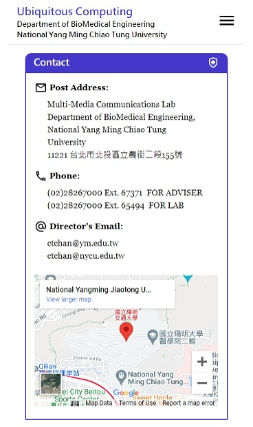
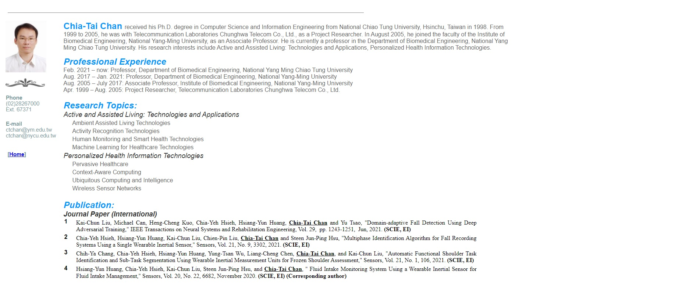
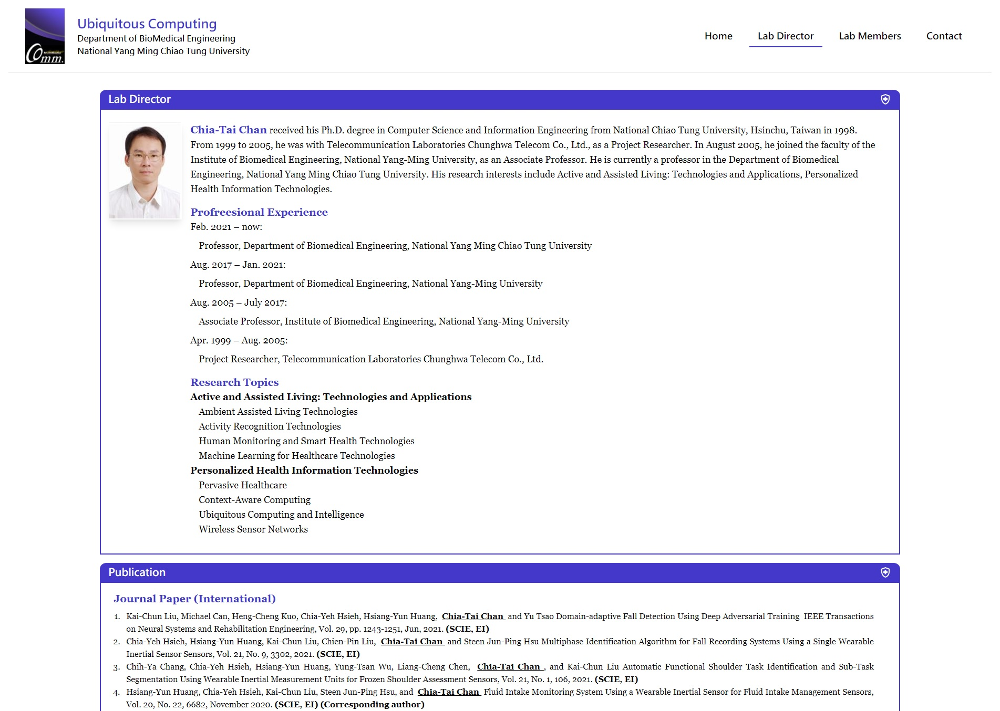
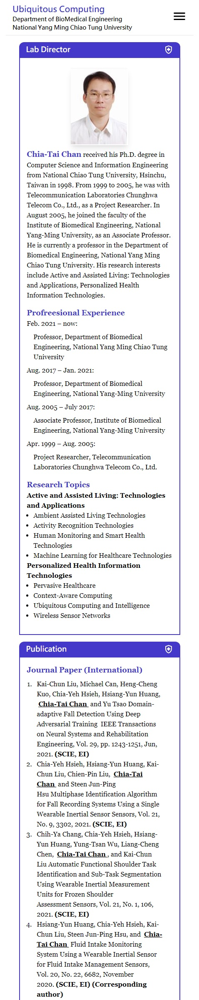

# Uclab-Vue-Page

* This page is built with Vue 3
  * Typescript
  * Tailwind CSS
  * Vue Router

* Reconstruct origin lab page to SPA and add RWD feature

----
### Before & After

**Before Home**

**After Home**

**Before Contact**

**After Contact**

**Before Director**

**After Director**

